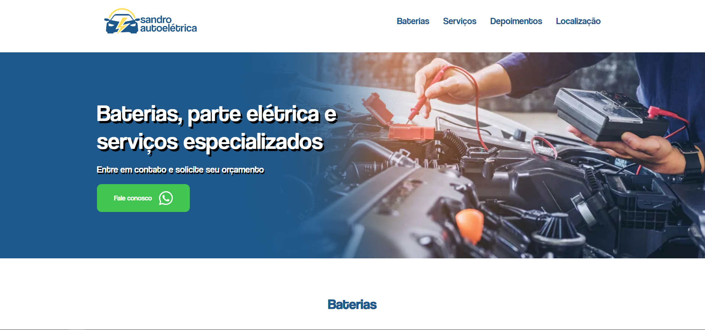

# Oficina Auto Elétrica 🚗⚡

> **Observação:** Este projeto foi desenvolvido como freelancer, porém não foi para frente e não chegou a ser publicado.

Projeto de página institucional responsiva para uma oficina auto elétrica, desenvolvido com foco em usabilidade, performance e experiência do usuário. Ideal para empresas do setor automotivo que desejam presença digital moderna e eficiente.

---

## 📖 Sobre o Projeto

Este projeto consiste em uma landing page estática, responsiva e otimizada, criada para apresentar os serviços de uma oficina auto elétrica, facilitar o contato com clientes e destacar diferenciais competitivos. O layout foi pensado para conversão e fácil navegação em qualquer dispositivo.

---

## 📱 Demonstração



---

## ✨ Principais Diferenciais

- **Design Responsivo**: Layout adaptável para smartphones, tablets e desktops.
- **Contato Rápido**: Botão de WhatsApp integrado para atendimento instantâneo.
- **Localização Interativa**: Mapa do Google Maps incorporado.
- **Depoimentos de Clientes**: Seção para avaliações e feedbacks.
- **Código Limpo e Semântico**: Seguindo boas práticas de HTML5 e CSS3.
- **Fácil Customização**: Estrutura simples para personalização de cores, textos e imagens.

---

## 🚀 Tecnologias Utilizadas

- **HTML5** — Estrutura semântica e acessível.
- **CSS3** — Estilização moderna e responsiva.
- **Google Maps Embed** — Exibição de localização.
- **WhatsApp API** — Integração para contato direto.

---

## 📂 Estrutura de Pastas

```
├── assets/         # Imagens e recursos visuais
├── css/            # Arquivos de estilos (CSS)
├── fonts/          # Fontes customizadas
├── index.html      # Página principal
└── README.md       # Documentação do projeto
```

---

## 🛠️ Como Executar Localmente

1. **Clone o repositório:**
   ```bash
   git clone https://github.com/ericfreitas88/sandro-autoeletrica.git
   ```
2. **Acesse a pasta do projeto:**
   ```bash
   cd sandro-autoeletrica
   ```
3. **Abra o arquivo `index.html` no seu navegador.**

> Não é necessário servidor backend ou instalação de dependências.

---

## 💡 Possíveis Melhorias

- Adicionar formulário de contato funcional.
- Otimizar SEO para melhor ranqueamento.
- Implementar animações e microinterações.
- Internacionalização (i18n).

---

## 👨‍💻 Autor

- **Eric Vilarino de Freitas**
- [LinkedIn](https://www.linkedin.com/in/eric-vilarino-de-freitas-18920851/)
<!-- - [Portfólio](https://ericfreitas.com.br/) -->

---

> Este projeto pode ser utilizado como base para sites institucionais de pequenas empresas, especialmente do ramo automotivo.
